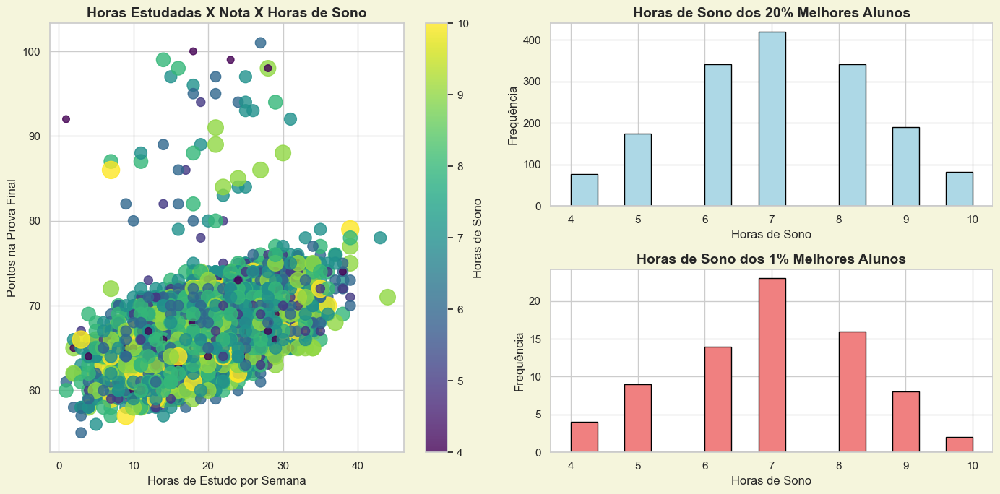

# Projeto de Visualização de Dados: Análise de Horas de Sono e Desempenho Acadêmico

## Descrição

Este projeto tem como objetivo analisar a relação entre as horas de sono e o desempenho acadêmico de alunos. Através de gráficos de dispersão e histogramas, exploramos como as variáveis como **Horas de Estudo**, **Motivação**, e **Notas em Exames** se correlacionam com o **Número de Horas de Sono**.

## Objetivos

- Visualizar a correlação entre **Horas de Sono** e **Nota no Exame Final**.
- Comparar a distribuição das **Horas de Sono** entre diferentes percentis de alunos (melhores e piores).
- Analisar a diferença no **Desempenho Acadêmico** de alunos com diferentes **Motivação** e **Horas de Sono**.

## Gráficos

1. **Gráfico 1: Horas de Estudo vs Nota no Exame vs Horas de Sono**
   - Este gráfico de dispersão mostra como as horas de estudo impactam a nota no exame, com o tamanho dos pontos representando as horas de sono.
   
2. **Gráfico 2: Horas de Sono dos 20% Melhores Alunos**
   - Um histograma que mostra a distribuição das horas de sono entre os 20% melhores alunos, com barras coloridas em azul claro.
   
3. **Gráfico 3: Horas de Sono dos 5% Melhores Alunos**
   - Outro histograma, mas agora focado nos 5% melhores alunos, com barras coloridas em vermelho claro.

